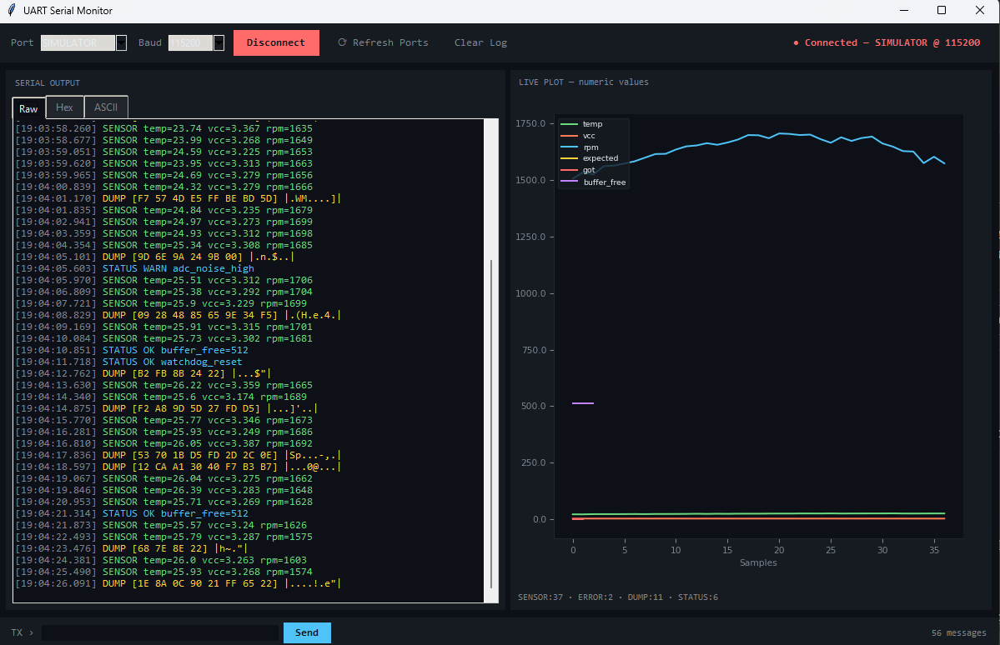

# UART Serial Monitor & Protocol Analyser

A desktop tool for monitoring, logging, and analysing UART serial communication — built for debugging embedded systems and microcontroller projects.

Connects to any serial/COM port and displays incoming data in real time across three views: raw output, hex dump, and ASCII. Numeric values are automatically extracted and plotted live.



## Features

- **Live serial terminal** — colour-coded by message type (SENSOR, STATUS, ERROR, DUMP)
- **Three simultaneous views** — Raw, Hex, and ASCII tabs updated in real time
- **Auto-plotting** — detects `key=value` numeric pairs and plots them automatically
- **Send commands** — transmit data back down the serial port from the UI
- **Simulator mode** — runs without any hardware using a realistic UART data simulator
- **Multi-baud support** — 9600 to 921600 baud

## Tech Stack

| Layer | Technology |
|-------|-----------|
| GUI | Python, tkinter |
| Serial I/O | pyserial |
| Live plotting | matplotlib (TkAgg backend) |
| Protocol parsing | Custom regex-based parser |
| Simulation | Threaded UART device simulator |

## Project Structure

```
uart-monitor/
├── main.py              # Application entry point + GUI
├── core/
│   ├── simulator.py     # UART device simulator (no hardware needed)
│   ├── serial_reader.py # Real serial port reader (pyserial)
│   └── parser.py        # Protocol parser — hex, ASCII, numeric extraction
├── requirements.txt
└── README.md
```

## Getting Started

### 1. Clone the repo

```bash
git clone https://github.com/YOUR_USERNAME/uart-monitor.git
cd uart-monitor
```

### 2. Install dependencies

```bash
pip install -r requirements.txt
```

### 3. Run

```bash
python main.py
```

### 4. Using simulator mode

Select **SIMULATOR** from the port dropdown (default) and click **Connect**. The simulator generates realistic UART output including sensor readings, status messages, hex dumps, and occasional error frames — no hardware required.

### 5. Connecting to real hardware

1. Plug in your device (Arduino, STM32, ESP32, etc.)
2. Click **⟳ Refresh Ports**
3. Select the correct COM port
4. Set the matching baud rate
5. Click **Connect**

## Protocol Parser

The parser recognises `key=value` pairs in incoming data and plots them automatically. For example:

```
SENSOR temp=23.4 vcc=3.31 rpm=1523
```

produces three live plot lines: `temp`, `vcc`, and `rpm`.

Message types are colour-coded:

| Type | Colour | Example |
|------|--------|---------|
| SENSOR | Green | `SENSOR temp=23.4 vcc=3.31` |
| STATUS | Blue | `STATUS OK uptime=120s` |
| DUMP | Yellow | `DUMP [AB CD EF] \|...` |
| ERROR | Red | `ERROR checksum_fail` |
| RAW | Grey | anything else |

## Why I Built This

During my Electronic Engineering degree at King's College London, I regularly needed to debug serial communication between microcontrollers and my PC — particularly while working on my FPGA CPU project. Existing tools were either too basic (no plotting) or too bloated. This was built to be lightweight, readable, and easily extensible.

## Licence

MIT
